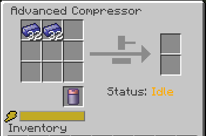
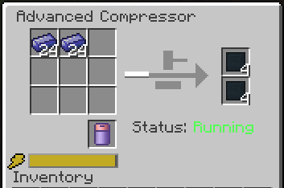

========================
Compressor Enhancements
========================

For reason's unknown. The Galacticraft Compressor & Advanced Compressor do not register ingots from other mods that are configured with Ore Dictionary. So it will be easier to explain what this feature does with an example.

------------------------------------------------------------------------------------------------------------

Without Compressor Enhancements
^^^^^^^^^^^^^^^^^^^^^^^^^^^^^^^

.. code-block:: guess

	compressor-enhancement {
	    # Set to true if you want to register Compressor Fixes
	    B:compressorFix=false
	}

In the Minecraft instance i have running. I have a mod called FunOres installed which adds various ores to the game. Galacticraft has its own ``Titanium Ingot``, Which can be placed into either Compressor to give you a ``Compressed Titanium`` plate.

However, if i was to try and add the ``Titanium Ingot`` from FunOres i will get the following result.

**FunOres Titaium Ingot**

**Compressor Not Producing Titanium Plate With Above Ingot**

------------------------------------------------------------------------------------------------------------

With Compressor Enhancements
^^^^^^^^^^^^^^^^^^^^^^^^^^^^

Now i have enabled the Compressor feature after closing Minecraft and will now restart

.. code-block:: guess

	compressor-enhancement {
	    # Set to true if you want to register Compressor Fixes
	    B:compressorFix=true
	}

After i restart and load up my world i open the Compressor GUI and place the ``Titanium Ingot`` from FunOres into the compressor....

And wouldn't you know it! I now have my Compressed Titanium Plates!

------------------------------------------------------------------------------------------------------------

Current OreDict Useage
^^^^^^^^^^^^^^^^^^^^^^

If a mod you have installed has registered their ingots with any of the following OreDict names, the compressor will produce the Galacticraft Compressed Plate of the input ingot type

   +------------------+--------------------------------+
   | **OreDict Name** | **Produces...**                |
   +==================+================================+
   | ``ingotTitanium``| Compressed Titanium Plate      |
   +------------------+--------------------------------+
   |  ``ingotCopper`` | Compressed Copper Plate        |
   +------------------+--------------------------------+
   |   ``ingotTin``   | Compressed Tin Plate           |
   +------------------+--------------------------------+
   |  ``ingotSteel``  | Compressed Steel Plate         |
   +------------------+--------------------------------+
   |  ``ingotBronze`` | Compressed Bronze Plate        |
   +------------------+--------------------------------+
   | ``ingotIron``    | Compressed Iron Plate          |
   +------------------+--------------------------------+